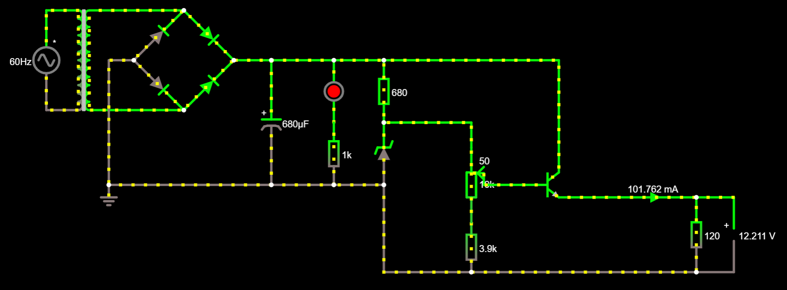

# Trabalho 1 - Projeto de Fonte de Tensão ajustável
Projeto realizado no primeiro semestre do curso de Bacharelado em Ciências de Computação, para a disciplina '[SSC0180] – Eletrônica para Computação', ministrada pelo professor Eduardo do Valle Simões, da USP de São Carlos.

# Alunos - grupo 2
Danielle Modesti - No USP: 12543544 ([Dani](https://github.com/danimodesti))

Hélio Nogueira Cardoso - No USP: 10310227 ([Hélio](https://github.com/rinderomna))

Raphael David Phillippe Levéque - No USP: 12542522 ([Croissant](https://github.com/raphaelleveque))

# Objetivo
Projetar uma Fonte de tensão retificadora, ajustável entre 3V e 12V, com capacidade de 100mA.

# Diagrama da Fonte

# Escolha de componentes

| Quantidade  | Componente  | Especificações   | Valor  |
|---|---|---|---|
| 1 | [Transformador](https://produto.mercadolivre.com.br/MLB-1314413008-transformador-012v-500ma-12v-05a-trafo-12vac-bivolt-_JM#position=1&search_layout=stack&type=item&tracking_id=44a140c7-95af-42aa-a8be-f100cbc91533) |Trafo Bivolt 0+12v 500ma|R$28,99|
| 1 | [Ponte de diodos](https://www.baudaeletronica.com.br/ponte-retificadora-kbpc1010.html) | Ponte Retificadora KBPC1010 |R$3,67| 
| 1 | [Capacitor](https://produto.mercadolivre.com.br/MLB-1321275288-kit-com-10-capacitores-eletrolitico-680uf-35v-para-projetos-_JM#position=1&search_layout=grid&type=pad&tracking_id=7cf9df7b-b42e-4aa4-8f1e-8146796ec8d1&is_advertising=true&ad_domain=VQCATCORE_LST&ad_position=1&ad_click_id=MjFjYWZiMDktMTQzMi00NTg1LThjYjMtNWQzZWIzZTQ4YmNl) |  a | a  |
| 1 | [LED](https://www.baudaeletronica.com.br/led-de-alto-brilho-10mm-vermelho.html) |Vermelho 3V - 3,3V 30mA|R$0,70|
| 1 | [Resistor 1k](https://www.baudaeletronica.com.br/resistor-1k-5-1w.html) |1000Ω +/-5%, 1W|R$0,18|
| 1 | [Resistor 680](https://www.baudaeletronica.com.br/resistor-680r-5-2w.html) | a  |  a |
| 1 | [Diodo Zener](https://www.baudaeletronica.com.br/diodo-zener-1n4743-13v-1w.html) | a  |  a |
| 1 | [Potenciômetro](https://www.baudaeletronica.com.br/potenciometro-linear-de-10k-10000.html) | a  |  a |
| 1 | [Resistor 3k9](https://www.baudaeletronica.com.br/resistor-3k9-5-2w.html) | a  |  a |
