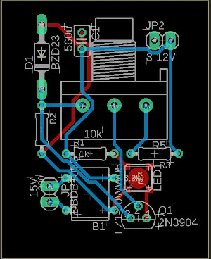

# Trabalho 1 - Projeto de Fonte de Tensão Ajustável
Projeto realizado no primeiro semestre do curso de Bacharelado em Ciências de Computação, para a disciplina '[SSC0180] – Eletrônica para Computação', ministrada pelo professor Eduardo do Valle Simões, da USP de São Carlos.

# Alunos - Grupo 2

| **Nome Completo**              | **N°USP**|
|--------------------------------|----------|
| [Danielle Modesti](https://github.com/danimodesti)               | 12543544 |
| [Hélio Nogueira Cardoso](https://github.com/rinderomna)         | 10310227 | 
| [Raphael David Phillippe Levéque](https://github.com/raphaelleveque)| 12542522 |

# Objetivo
Projetar uma fonte de tensão retificadora, ajustável entre 3V e 12V, com capacidade de 100mA.

# Diagrama da Fonte

[Link para o circuito no Falstad](https://tinyurl.com/yengesgj)

# Escolha de Componentes

| Quantidade  | Componente  | Especificações   | Valor  |
|---|---|---|---|
| 1 | [Transformador](https://produto.mercadolivre.com.br/MLB-1253943633-transformador-trafo-1818v-200ma-bivolt-eletronica-_JM#position=1&search_layout=stack&type=item&tracking_id=167d04df-57da-4808-83a5-ea7012a22afe) |Trafo Bivolt 18+18v 200mA|R$27,99|
| 1 | [Ponte de Diodos](https://www.baudaeletronica.com.br/ponte-retificadora-kbpc1010.html) | Ponte Retificadora KBPC1010 |R$3,67| 
| 1 | [Capacitor](https://produto.mercadolivre.com.br/MLB-1673538375-capacitor-d97-eletrolitico-smd-560uf-25v-emb-10-pcs-_JM?matt_tool=87716990&matt_word=&matt_source=google&matt_campaign_id=12413740998&matt_ad_group_id=119070072438&matt_match_type=&matt_network=g&matt_device=c&matt_creative=500702333978&matt_keyword=&matt_ad_position=&matt_ad_type=pla&matt_merchant_id=109554163&matt_product_id=MLB1673538375&matt_product_partition_id=337120033364&matt_target_id=pla-337120033364&gclid=CjwKCAjwuvmHBhAxEiwAWAYj-Ay7yDPELDOSm39X_i7gBUjtOCS0CwJmOsPk51wYcrQWBM-lYwfB2xoCgIcQAvD_BwE) |560µF, 25V|R$1,10|
| 1 | [LED](https://www.baudaeletronica.com.br/led-de-alto-brilho-10mm-vermelho.html) |Vermelho 3V - 3,3V 30mA|R$0,70|
| 1 | [Diodo Zener](https://www.baudaeletronica.com.br/diodo-zener-1n4743-13v-1w.html) |1N4743 [13V / 1W]|R$0,19|
| 1 | [Potenciômetro](https://www.baudaeletronica.com.br/potenciometro-linear-de-10k-10000.html){:target="_blank"} |10000Ω|R$1,61|
| 1 | [Resistor 680](https://www.baudaeletronica.com.br/resistor-680r-5-2w.html) |680Ω +/-5%, 2W|R$0,38|
| 1 | [Resistor 1k](https://www.baudaeletronica.com.br/resistor-1k-5-1w.html) |1000Ω +/-5%, 1W|R$0,18|
| 1 | [Resistor 3k9](https://www.baudaeletronica.com.br/resistor-3k9-5-2w.html) |3900Ω +/-5%, 2W|R$0,38|
| Total | | |R$36,20|

# Projeto Esquemático do PCB no Software Eagle

# Vídeos Explicativos
[Vídeo explicando cálculos](https://www.youtube.com/watch?v=foXTuA22R3k)

[Vídeo explicando as etapas](https://www.youtube.com/watch?v=o96vAONC0xM)
